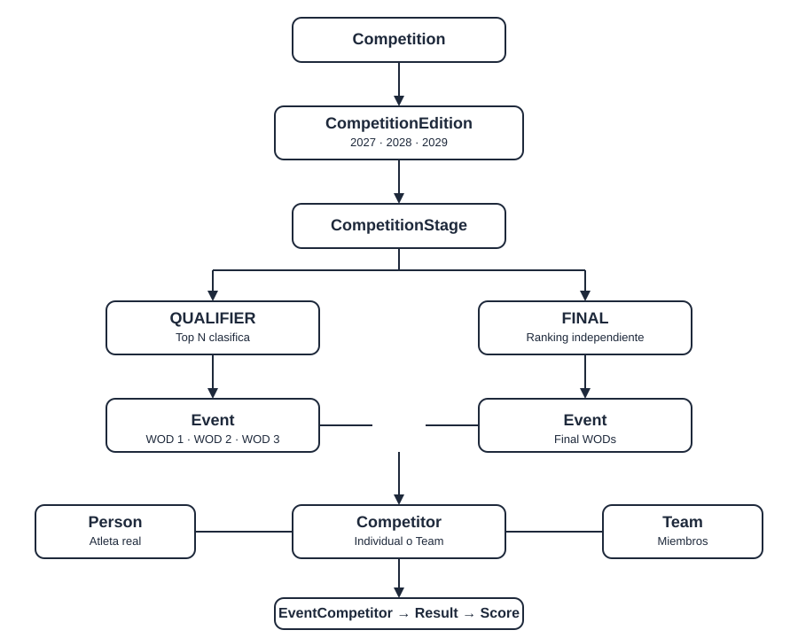
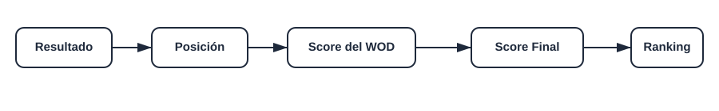

# Scorely

Backend para la gestión y publicación de resultados de competiciones deportivas (CrossFit, HYROX).

Construido con **Django 4.2 LTS + Django REST Framework + PostgreSQL**, empaquetado con **Docker Compose**.

## Funcionalidad principal

- Gestión de competiciones (año, fechas y estado).
- Registro de participantes individuales y equipos.
- Configuración de categorías por competición.
- Registro de resultados por evento (WOD).
- Cálculo automático de rankings y tabulación.
- Tablas de puntuación configurables por competición.
- Publicación de leaderboards públicos.
- Fases Qualifier y Final con clasificación independiente.

## Arquitectura

```
scorely/
├── config/                 # Configuración del proyecto (settings, urls, wsgi, asgi)
├── apps/
│   ├── users/              # Usuarios y administradores por competición
│   ├── competitions/       # Competiciones, tipos, sedes, estados
│   ├── participants/       # Atletas, equipos, competidores
│   ├── events/             # Eventos (WODs), categorías, resultados
│   ├── scoring/            # Tablas de puntuación
│   └── rankings/           # Leaderboards y servicios de clasificación
├── tests/                  # Suite de pytest
├── manage.py
├── Dockerfile
├── docker-compose.yml
└── requirements.txt
```

> Toda la lógica de negocio vive en `services/`, nunca en `views/`.

## Tech Stack

| Componente | Tecnología |
|------------|-----------|
| Lenguaje | Python 3.8+ (3.11 en Docker) |
| Framework | Django 4.2 LTS |
| API | Django REST Framework |
| Base de datos | PostgreSQL 15 |
| Autenticación | djangorestframework-simplejwt |
| Filtrado | django-filter |
| Documentación | drf-spectacular |
| Testing | pytest + pytest-django |
| Contenedores | Docker + Docker Compose |

## Requisitos previos

- Docker Desktop (o Docker Engine + Compose).
- Python 3.8+ si se quiere ejecutar fuera de contenedores.

## Puesta en marcha (Docker)

```bash
# 1. Configurar variables de entorno
cp .env.example .env

# 2. Levantar los servicios (web + db)
docker compose up --build

# 3. Aplicar migraciones (nuevo entorno)
docker compose exec web python manage.py makemigrations
docker compose exec web python manage.py migrate

# 4. Crear superusuario para el admin
docker compose exec web python manage.py createsuperuser

# 5. (Opcional) Cargar datos de ejemplo
docker compose exec web python manage.py seed_data
```

La API queda disponible en `http://localhost:8000`.

**Documentación de la API** (Swagger/ReDoc) accesible en:

| URL | Contenido |
|-----|-----------|
| `http://localhost:8000/api/docs/` | Swagger UI (interfaz interactiva) |
| `http://localhost:8000/api/redoc/` | ReDoc |
| `http://localhost:8000/api/schema/` | Esquema OpenAPI (YAML) |

## Puesta en marcha (local, sin Docker)

> Requiere PostgreSQL accesible y un `.env` con `DB_HOST=localhost`.

```bash
# Crear y activar virtualenv
python -m venv .venv
.venv\Scripts\activate   # Windows
source .venv/bin/activate  # Linux/macOS

# Instalar dependencias
pip install -r requirements.txt

# Configurar
cp .env.example .env   # ajustar DB_HOST, POSTGRES_*, SECRET_KEY

# Migraciones y superusuario
python manage.py makemigrations --settings=config.settings.development
python manage.py migrate --settings=config.settings.development
python manage.py createsuperuser --settings=config.settings.development

# (Opcional) Cargar datos de ejemplo
python manage.py seed_data --settings=config.settings.development

# Servidor de desarrollo
python manage.py runserver --settings=config.settings.development
```

## Variables de entorno

| Variable | Descripción | Default |
|----------|-------------|---------|
| `SECRET_KEY` | Clave secreta de Django (¡no se debe versionar!) | — |
| `DEBUG` | Modo debug | `True` |
| `ALLOWED_HOSTS` | Hosts permitidos, separados por coma | `localhost,127.0.0.1` |
| `DATABASE_URL` | URL de conexión a PostgreSQL | `postgres://scorely_user:scorely_pass@db:5432/scorely_db` |
| `POSTGRES_DB` | Nombre de la base de datos | `scorely_db` |
| `POSTGRES_USER` | Usuario de la base de datos | `scorely_user` |
| `POSTGRES_PASSWORD` | Contraseña de la base de datos | `scorely_pass` |
| `DB_HOST` | Host de la base (`.env` local usa `localhost`; Docker lo fuerza a `db`) | `db` |
| `DB_PORT` | Puerto de la base de datos | `5432` |
| `CORS_ALLOWED_ORIGINS` | Orígenes CORS permitidos | `http://localhost:3000` |

> **Nunca** commitear el `.env`.

## Comandos útiles

```bash
docker compose up --build        # Levantar todo
docker compose exec web python manage.py migrate
docker compose exec web python manage.py createsuperuser
docker compose exec web python manage.py seed_data
docker compose exec web pytest   # Ejecutar tests dentro del contenedor
docker compose down              # Detener servicios
```

### Tests (endpoint)

```bash
python -m pytest tests --settings=config.settings.development
```

## API

Base URL: `http://localhost:8000/api/v1/`

| Recurso | Endpoint |
|---------|----------|
| Autenticación | `POST /auth/token/`, `POST /auth/token/refresh/` |
| Usuarios | `GET/POST /users/`, `GET /users/<id>/` |
| Admins de competición | `GET/POST /competition-admins/` |
| Tipos de competición | `GET/POST /competition-types/` |
| Afiliaciones | `GET/POST /affiliations/` |
| Sedes | `GET/POST /locations/` |
| Competiciones | `GET/POST /competitions/` |
| Categorías | `GET/POST /competition-categories/` |
| Categorías habilitadas | `GET/POST /enabled-competition-categories/` |
| Fases (stage) | `GET/POST /competition-stages/` |
| Eventos (WODs) | `GET/POST /events/` |
| Tipos de resultado | `GET/POST /event-result-types/` |
| Dirección de ranking | `GET/POST /rank-directions/` |
| Resultados por evento | `GET/POST /event-competitors/` |
| Estados de resultado | `GET/POST /status-event-competitors/` |
| Atletas | `GET/POST /athletes/` |
| Equipos | `GET/POST /teams/` |
| Miembros de equipo | `GET/POST /team-members/` |
| Competidores | `GET/POST /competitors/` |
| Reglas de puntuación | `GET/POST /scoring-rules/` |
| Leaderboard público | `GET /leaderboards/competition/<id>/qualifier/`, `GET /leaderboards/competition/<id>/final/` |

Autenticación con header: `Authorization: Bearer <access_token>`. Los leaderboards son públicos (`AllowAny`).

## Documentación Swagger/OpenAPI

La API se documenta sola con `drf-spectacular` a partir de los serializers y viewsets.

| Ruta | Contenido |
|------|-----------|
| `/api/docs/` | Swagger UI (interfaz interactiva para probar endpoints) |
| `/api/redoc/` | ReDoc |
| `/api/schema/` | Esquema OpenAPI (YAML) |

## Modelo conceptual

### Flujo de competición



```
Competition
  └─▶ CompetitionStage (QUALIFIER | FINAL)
        └─▶ Event (WOD)
              └─▶ EventCompetitor  (result + event_rank + score)
                    └─▶ Final Score
                          └─▶ Leaderboard
```

### Participantes

```
Athlete ────────┐
                ▼
           Competitor         ← la máquina de puntuación SIEMPRE trabaja con Competitor
                ▲
                │
            Team
                │
          TeamMember
```

> Un `Competitor` puede ser `INDIVIDUAL` (usa `athlete`) o `TEAM` (usa `team`), nunca ambos.

### Reglas de negocio clave

- `Slug` único en `Competition`; el año se deriva de `start_date`.
- Exactamente **una** fase `QUALIFIER` y **una** fase `FINAL` por competición.
- `UNIQUE(competition_stage, event_number)` en Event.
- `UNIQUE(competitor, event)` en EventCompetitor.
- `UNIQUE(competition, competition_category)` en categorías habilitadas.
- Cada competición define su propia tabla de puntuación (`ScoringRule`).

### Modelos principales

| App | Modelos |
|-----|---------|
| users | `User`, `CompetitionAdmin` |
| competitions | `CompetitionType`, `Affiliation`, `Location`, `StatusCompetition`, `Competition` |
| participants | `Athlete`, `Team`, `TeamMember`, `Competitor` |
| events | `CompetitionCategory`, `EnabledCompetitionCategory`, `CompetitionStage`, `Event`, `EventResultType`, `RankDirection`, `EventCompetitor`, `StatusEventCompetitor` |
| scoring | `ScoringRule` |

## Sistema de puntuación (escore)

> **El resultado NO es la puntuación.**



```
Resultado → Posición (rank) → Puntos WOD (ScoringRule) → Puntaje Final → Leaderboard
```

### Flujo

1. El resultado crudo se interpreta con `ResultParser` según el tipo de evento.
2. `EventRankingService` ordena según `rank_direction` y asigna posiciones (ranking deportivo/denso).
3. `ScoringService` convierte la posición en puntos usando la tabla de la competición (`ScoringRule`).
4. `CompetitionRankingService` suma los puntos de todos los eventos válidos → Puntaje Final y clasificación general por categoría.
5. `FinalQualificationService` determina quiénes avanzan del Qualifier al Final.

### Tipos de resultado

| Código | Descripción |
|--------|-------------|
| `TIME` | Duración (menor es mejor) |
| `REPS` | Repeticiones (mayor es mejor) |
| `WEIGHT` | Peso levantado (mayor es mejor) |
| `DISTANCE` | Distancia recorrida (mayor es mejor) |
| `POINTS` | Puntos obtenidos (mayor es mejor) |

### Dirección de ranking

| Código | Regla |
|--------|-------|
| `ASC` | Valores menores rankean primero |
| `DESC` | Valores mayores rankean primero |

### Ejemplos de eventos

| Evento | Tipo | Dirección |
|--------|------|-----------|
| Fran | TIME | ASC |
| AMRAP | REPS | DESC |
| Max Snatch | WEIGHT | DESC |
| HYROX Race | TIME | ASC |

### Tabla de puntos por competición (ScoringRule)

Cada competición define su propia tabla. **Nunca asumir una fórmula fija.**

Ejemplo A:

| Posición | Puntos |
|----------|--------|
| 1 | 100 |
| 2 | 94 |
| 3 | 88 |
| 4 | 82 |
| 5 | 76 |

Ejemplo B (otra competición):

| Posición | Puntos |
|----------|--------|
| 1 | 100 |
| 2 | 99 |
| 3 | 98 |

### Empates con ranking deportivo (denso)

Los empates comparten posición y la siguiente salta:

```
Correcto:  1, 2, 2, 4
Incorrecto: 1, 2, 3, 4
```

Si dos atletas empatan en 2º, ambos reciben posición 2 y sus puntos (94).

### Puntaje final

```
Puntaje Final = SUM(puntos de todos los eventos válidos)
```

Ejemplo trabajado:

| WOD | Posición | Puntos |
|-----|----------|--------|
| WOD 1 | 2 | 94 |
| WOD 2 | 1 | 100 |
| WOD 3 | 2 | 94 |
| WOD 4 | 1 | 100 |
| WOD 5 | 1 | 100 |
| **Total** | **—** | **488** |

### Desempate (clasificación general)

1. Mayor Puntaje Final.
2. Más primeros lugares.
3. Más segundos lugares.
4. Más terceros lugares.
5. Mejor resultado en el último evento en común.
6. Si persiste, mantener el empate.

**Prohibido usar como desempate:** ID, nombre o fecha de registro.

### Qualifier → Final

- La clasificación se calcula **por categoría**.
- `qualification_count = 5` → los top 5 avanzan al Final.
- El Final tiene un ranking **completamente independiente**.
- **Nunca** sumar automáticamente puntos de Qualifier + Final.

## Verificación

- `python manage.py check` → sin errores.
- `python manage.py spectacular --validate` → schema OpenAPI válido.
- `python manage.py makemigrations --check` → sin migraciones pendientes.
- Suite de tests: **81 passed** (pytest-django, `--settings=config.settings.development`).